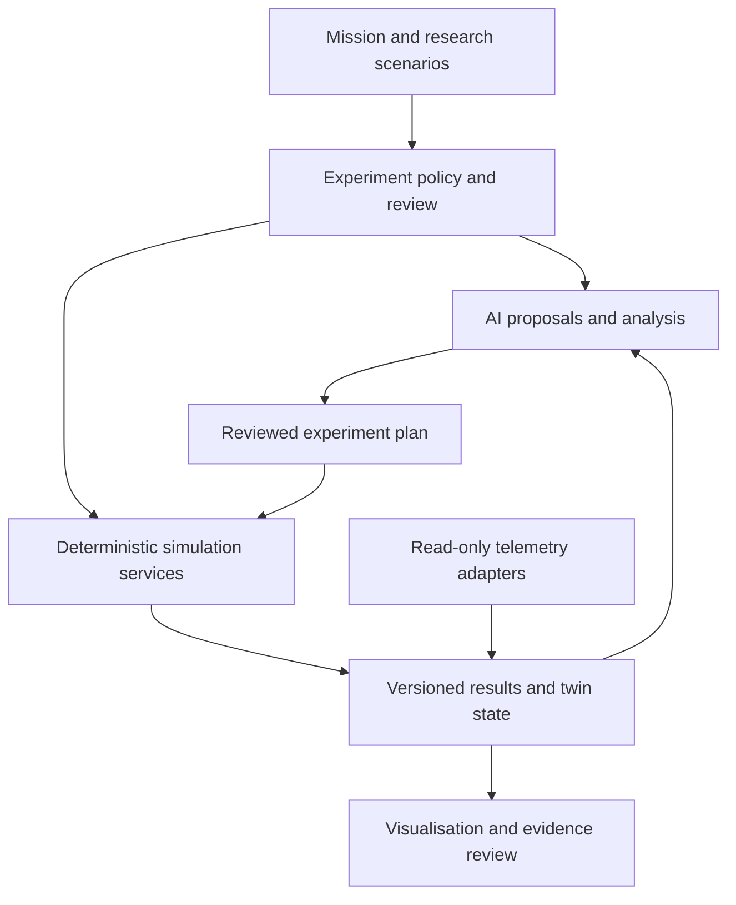
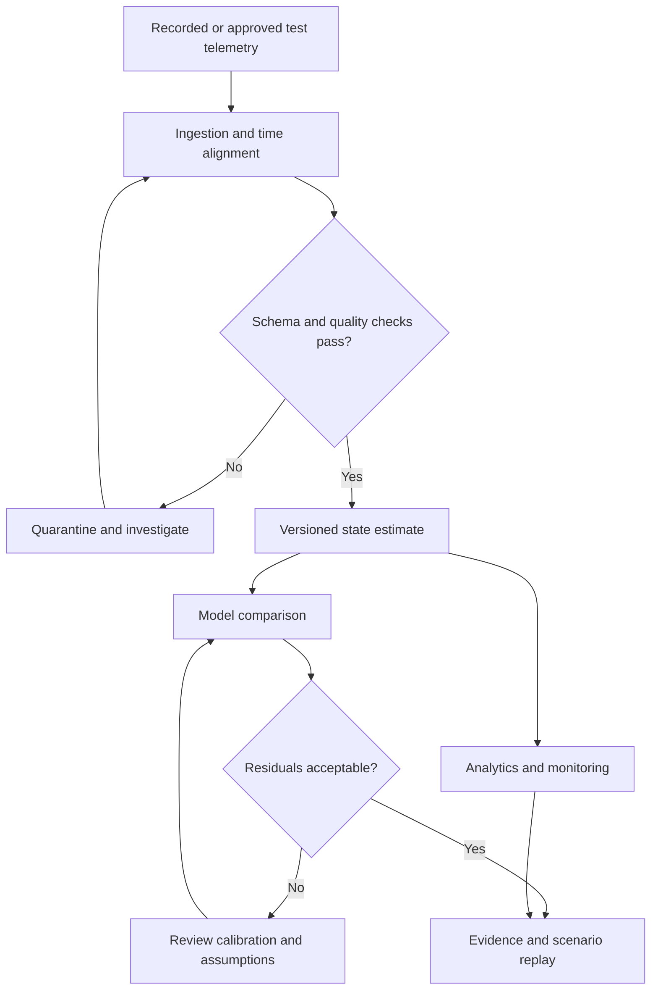
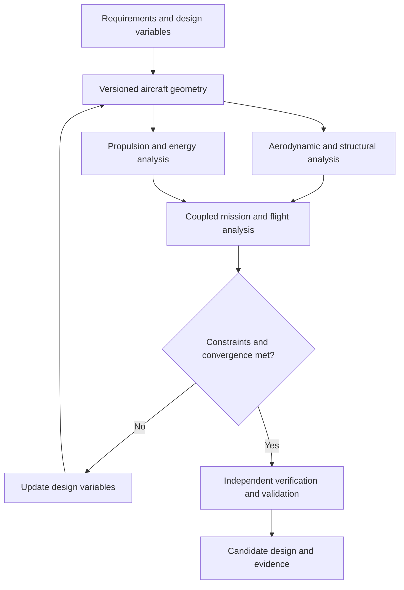
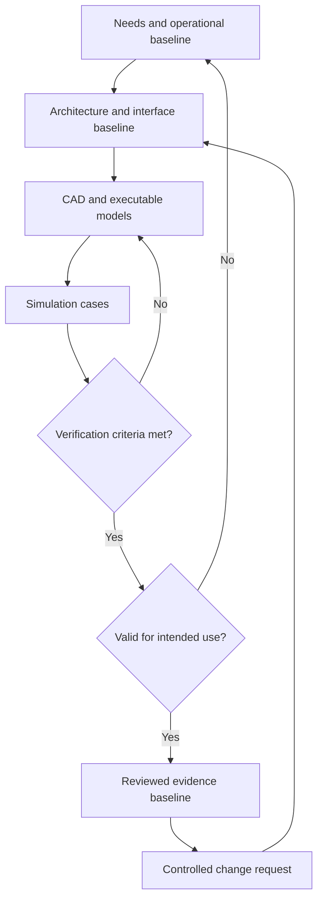
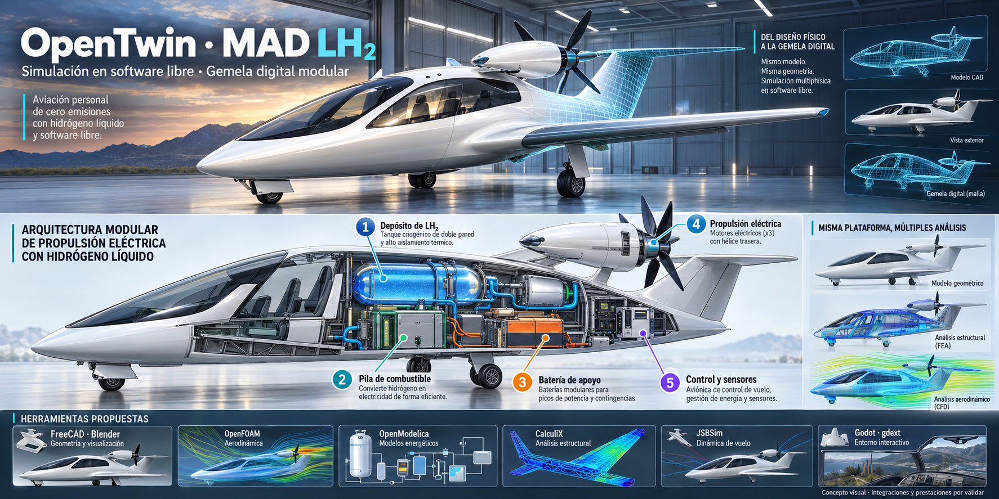
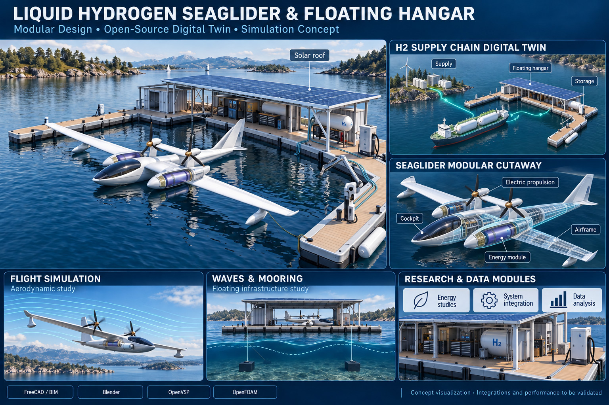
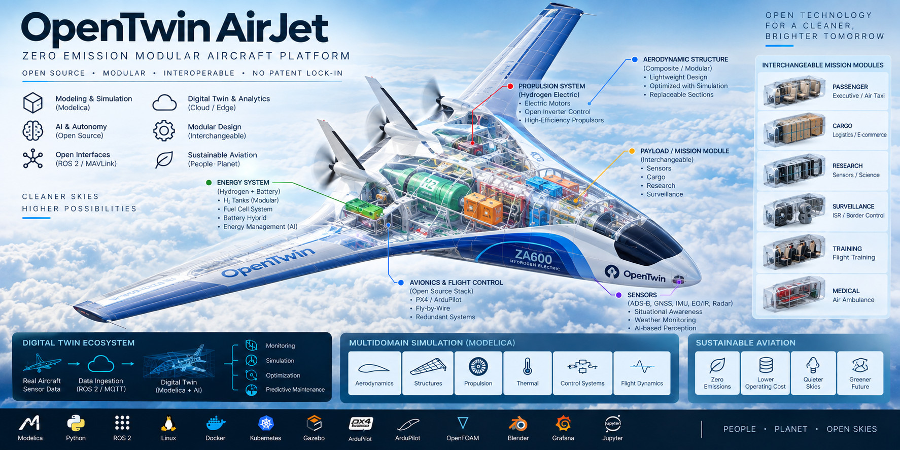

# jfxai4mjas

**AI-Powered Modular Jet & Aircraft Simulation Platform**

> Open-source reference architecture and technology compendium for
> aircraft design, Modelica-based multidomain simulation, MBSE, digital
> twins, artificial intelligence, autonomy, optimization and modular
> aviation systems.

**jfxai4mjas** is an open engineering and research project for the study
of **Modular Jet & Aircraft Systems (MJAS)**.

The project consolidates open-source aircraft engineering technologies
into a technology-neutral framework spanning conceptual design, MBSE,
CAD/CAM/CAS, aerodynamics, structures, propulsion, flight dynamics,
avionics, autonomous flight, Modelica, multidisciplinary optimization
and digital twins.

**Current baseline:** documentation, three CAD concept illustrations and eight Draw.io requirements/architecture files. The workflows below are proposed integrations, not an installed simulator or operational digital twin. No root license file or executable application is present in this baseline.

The goal is not to reproduce a specific commercial aircraft or
proprietary platform. The repository instead promotes sufficiently
abstract, reusable and interoperable models for education, simulation,
research and experimental engineering.

------------------------------------------------------------------------

## Table of Contents

- [Project Vision](#project-vision)
- [Description and Context](#description-and-context)
- [Objectives](#objectives)
- [Reference Architecture](#reference-architecture)
- [Engineering Domains](#engineering-domains)
- [OpenTwin Air Digital Twin](#opentwin-air-digital-twin)
- [Modelica and Multidomain Simulation](#modelica-and-multidomain-simulation)
- [AI and Autonomous Flight](#ai-and-autonomous-flight)
- [Aircraft Design and MDAO](#aircraft-design-and-mdao)
- [Open-Source Technology Compendium](#open-source-technology-compendium)
- [MBSE Engineering Process](#mbse-engineering-process)
- [Modular Aircraft Concept](#modular-aircraft-concept)
- [CAD Concept Catalogue](#cad-concept-catalogue)
- [Existing Repository Assets](#existing-repository-assets)
- [Repository Structure](#repository-structure)
- [User Guide](#user-guide)
- [Installation Guide](#installation-guide)
- [Dependencies](#dependencies)
- [Development Roadmap](#development-roadmap)
- [How to Contribute](#how-to-contribute)
- [Code of Conduct](#code-of-conduct)
- [Authors and Maintainers](#authors-and-maintainers)
- [Intellectual Property](#intellectual-property)
- [Disclaimer](#disclaimer)
- [License](#license)
- [Open Engineering Principles](#open-engineering-principles)

------------------------------------------------------------------------

## Project Vision

jfxai4mjas explores an open aviation engineering stack based on:

**MBSE + Open Aircraft Models + Modelica + Digital Twins + AI +
Autonomy + MDAO**

The long-term objective is to make aircraft research less dependent on a
single proprietary CAD suite, simulator, optimization framework,
avionics stack, aircraft configuration or cloud provider.

Core principles:

1.  **Open architecture**
2.  **Modular engineering**
3.  **Interoperability**
4.  **Simulation-first development**
5.  **Replaceable technology components**
6.  **Reproducible research**
7.  **Sustainable aviation research**

------------------------------------------------------------------------

## Description and Context

Aircraft engineering is inherently multidisciplinary. A useful virtual
aircraft must combine aerodynamics, structures, propulsion, energy,
thermal behavior, flight dynamics, control, avionics, sensors,
communications, optimization and systems engineering.

jfxai4mjas organizes these disciplines as interoperable research domains
and provides a compendium of open technologies that can support them.

The repository covers research applicable to:

-   conventional aircraft;
-   business and regional aircraft;
-   unmanned aircraft;
-   fixed-wing UAVs;
-   VTOL and hybrid VTOL systems;
-   electric aircraft;
-   hybrid-electric aircraft;
-   hydrogen aviation concepts;
-   solar aircraft;
-   seaplanes;
-   experimental research aircraft;
-   modular mission aircraft;
-   software-defined avionics;
-   digital aircraft twins.

------------------------------------------------------------------------

## Objectives

### Primary Objective

Develop a reusable open engineering framework for modeling, simulating,
optimizing and evaluating modular aircraft systems.

### Specific Objectives

-   Integrate MBSE with executable aircraft models.
-   Use Modelica for multidomain physical simulation.
-   Connect aerodynamic and structural optimization.
-   Support conceptual MDAO workflows.
-   Investigate open flight-control and autonomy stacks.
-   Support Software-in-the-Loop and Hardware-in-the-Loop research.
-   Develop a generic aircraft digital-twin architecture.
-   Integrate AI for analytics, optimization and autonomy.
-   Investigate conventional, electric, hybrid and hydrogen propulsion.
-   Maintain a catalog of open aviation engineering technologies.
-   Clearly separate research references from actual project
    dependencies.

------------------------------------------------------------------------

## Reference Architecture



Aircraft command publication is outside this default research path. Any SIL/HIL control experiment needs a separately scoped interface and test configuration.

------------------------------------------------------------------------

## Engineering Domains

| Domain | Purpose |
| --- | --- |
| MBSE | Requirements, architecture and traceability |
| Aerodynamics | Geometry, flow, loads and performance |
| Structures | Airframe and aeroelastic/aerostructural analysis |
| Propulsion | Turbofan, turbojet, electric and hybrid concepts |
| Energy | Fuel, battery, hydrogen and energy management |
| Thermal | Cooling and thermal-management systems |
| Flight Dynamics | Aircraft motion, stability and performance |
| Control | Flight-control laws and actuator systems |
| Avionics | Displays, data networks and onboard computing |
| Sensors | GNSS, IMU, air data, radar, vision and EO/IR |
| Autonomy | Guidance, navigation, perception and planning |
| MDAO | Multidisciplinary design analysis and optimization |
| Digital Twin | Physical/virtual synchronization and analytics |
| Mission Systems | Interchangeable application-specific payloads |

------------------------------------------------------------------------

## OpenTwin Air Digital Twin

**OpenTwin Air** is the project's generic digital-aircraft-twin concept.
It is not intended to reproduce or claim ownership of a proprietary
digital-twin product.



A live twin additionally requires an identified physical asset, measured data, synchronisation and maintained calibration. Until then, use the terms virtual model or replay prototype. Health analytics are research outputs, not maintenance-release decisions.

Candidate interfaces include:

-   ROS 2;
-   MAVLink;
-   DDS;
-   MQTT;
-   OPC UA where appropriate;
-   REST APIs;
-   simulation co-simulation interfaces;
-   aircraft telemetry interfaces.

------------------------------------------------------------------------

## Modelica and Multidomain Simulation

Modelica is used conceptually as the physical-modeling backbone for
systems whose behavior spans several engineering domains.

| Model group | Candidate subsystems |
| --- | --- |
| Vehicle plant | Aerodynamics, structures and flight dynamics |
| Propulsion and energy | Turbine, electric or hybrid propulsion; fuel, battery or hydrogen storage |
| Thermal and actuation | Cooling, actuators and associated power demand |
| Controls and mission | Flight-control plant interfaces and payload loads |

Define units, coordinate frames, time steps and exchange variables before coupling models. Not every aerodynamic or structural solver needs to run inside Modelica.

Potential uses include:

-   propulsion transient simulation;
-   electric power systems;
-   thermal management;
-   actuator models;
-   fuel and energy systems;
-   flight-control plant models;
-   UAV multidomain modeling;
-   reconfigurable aircraft-system simulation.

------------------------------------------------------------------------

## AI and Autonomous Flight

AI is treated as a modular capability rather than a replacement for
validated flight-control engineering.

### Potential Research Areas

#### Perception

-   computer vision;
-   object and terrain detection;
-   sensor fusion;
-   landing-zone analysis.

#### Prediction

-   trajectory estimation;
-   component health;
-   energy consumption;
-   weather-aware performance.

#### Optimization

-   aircraft configuration;
-   mission planning;
-   trajectory optimization;
-   energy management;
-   surrogate modeling.

#### Autonomy

-   guidance and navigation;
-   mission planning;
-   UAV autonomy;
-   decision support;
-   fault-aware reconfiguration.

Safety-critical deployment is outside the scope of an unvalidated
research prototype and requires appropriate certification and
independent verification.

------------------------------------------------------------------------

## Aircraft Design and MDAO

jfxai4mjas connects conceptual design with multidisciplinary analysis.



An optimiser's converged solution is a candidate for review, not proof of feasibility or airworthiness.

Research technologies represented in the compendium include OpenMDAO,
OpenConcept, OpenAeroStruct, AeroSandbox, pyOptSparse, pyBADA and other
aeronautical analysis frameworks.

------------------------------------------------------------------------

## Open-Source Technology Compendium

The technologies below are **research references** unless a particular
module explicitly declares them as dependencies.

### Conceptual Design, Aerodynamics and Optimization

| Technology | Research Role |
| --- | --- |
| AeroSandbox | Aircraft modeling and optimization |
| OpenConcept | Conceptual aircraft MDAO |
| OpenAeroStruct | Aerostructural optimization |
| OpenMDAO | Multidisciplinary analysis and optimization |
| pyOptSparse | Nonlinear constrained optimization |
| pyBADA | Aircraft performance and trajectory modeling |
| scikit-aero | Aeronautical engineering calculations |
| OpenVSP | Parametric aircraft geometry |
| OpenFOAM | CFD research |

### Flight Dynamics and Control

| Technology | Research Role |
| --- | --- |
| FMACM | Aircraft dynamics and control modeling |
| MScSim | Real-time flight-dynamics simulation |
| Aircraft Dynamics and Control libraries | Dynamic modeling |
| NextPilot | Flight-control research |
| PX4 | Open flight-control ecosystem |
| ArduPilot | Autopilot and autonomous vehicle stack |

### Autonomy, UAV and VTOL

Research references include:

-   GAAS;
-   aerial autonomy stacks;
-   MiniHawk VTOL resources;
-   DroneLibrary for Modelica;
-   open UAV and flight-control platforms;
-   ROS 2 integration;
-   MAVLink-based integration.

### Avionics

The repository studies technologies and concepts including:

-   OMOSA avionics;
-   open avionics architectures;
-   AFDX simulation with OMNeT++;
-   PyEFIS;
-   Micro XRCE-DDS;
-   open telemetry and communication middleware.

### Propulsion and Energy

Research topics include:

-   microjet and micro gas-turbine models;
-   turbojet/turbofan simulation;
-   electric propulsion conversion;
-   hybrid-electric aircraft;
-   hydrogen-hybrid aircraft;
-   battery systems;
-   solar-aircraft concepts;
-   energy and thermal optimization.

### Modelica and System Simulation

Relevant technologies include:

-   Modelica;
-   OpenModelica;
-   Hopsan;
-   DroneLibrary;
-   transient simulation frameworks;
-   aircraft dynamics/control libraries;
-   co-simulation approaches.

### Engineering and Visualization

Potential tools include:

| Layer | Candidate Technologies |
| --- | --- |
| MBSE | Capella / Arcadia |
| CAD | FreeCAD / aircraft-oriented workbenches |
| Geometry | OpenVSP |
| Physical Modeling | Modelica / OpenModelica |
| CFD | OpenFOAM |
| MDAO | OpenMDAO |
| Robotics | ROS 2 |
| Flight Control | PX4 / ArduPilot |
| Messaging | MAVLink / DDS |
| Simulation | Gazebo and domain-specific simulators |
| AI / Data | Python ecosystem |
| Computer Vision | OpenCV |
| Visualization | Blender / Grafana / Jupyter |
| Containers | Docker |
| Orchestration | Kubernetes |

------------------------------------------------------------------------

## MBSE Engineering Process

The repository already uses an MBSE-oriented organization. The
recommended evolution is:

The lifecycle is: **Stakeholder Needs → Operational Analysis → System Context → Capabilities → Architecture → Interfaces → Models → Simulation → Verification → Validation**. Maintain requirement and evidence identifiers throughout.



**MBSE** provides requirements and architecture through approaches such
as Arcadia/Capella.

**CAD** supports original and sufficiently simplified aircraft geometry.

**CAM** covers manufacturing-oriented prototype and assembly studies.

**CAS** covers simulation of end-to-end behavior, performance,
aerodynamics, propulsion, controls and autonomy.

------------------------------------------------------------------------

## Modular Aircraft Concept

The project separates common aircraft services from mission-specific
modules.

| Common platform | Mission-specific configuration |
| --- | --- |
| Airframe, flight control, avionics and sensors | Passenger, cargo or training module |
| Communications, energy and propulsion | Research, sensing or medical/rescue payload |
| Versioned aircraft interfaces | Uncrewed mission configuration where separately validated |

For each interchangeable module, define mechanical attachment, mass and centre of gravity, power, cooling, data, failure containment and configuration identification. Reassess the aircraft envelope after a module change.

This architecture is conceptual. Any physical implementation must be
supported by independent structural, aerodynamic, stability, safety and
certification analysis.

------------------------------------------------------------------------

## CAD Concept Catalogue

The [MBSE/CAD directory](MBSE/CAD/) contains three concept boards. Mesh overlays, cutaways and simulated flow colours are illustrations, not solver results. Image labels such as “zero emissions”, “no patent lock-in” and performance claims are aspirations requiring independent evidence. No physical prototype or certified capability is established here.

### OpenTwin MAD LH₂



A compact personal-aircraft study combines a cabin, cryogenic liquid-hydrogen storage, fuel-cell conversion, buffer batteries, electric propulsion and flight-control electronics. The board aligns an exterior render, cutaway and virtual mesh with proposed aerodynamic, structural and flight-dynamics studies.

The propulsion label states three electric motors, while the illustrated installation does not fully resolve their arrangement. Treat motor count, mounting and operating modes as open requirements; the image does not establish a tiltrotor or VTOL capability. Its zero-emissions label is not a lifecycle assessment.

**Proposed studies:** mass and centre-of-gravity budgets, energy and thermal balances, cryogenic storage assumptions, aerodynamic interference and flight dynamics. Geometry consistency and subsystem interfaces must be resolved before coupled simulation.

### LH₂ Seaglider and Floating Hangar



This concept couples an electrically propelled waterborne aircraft with a modular floating hangar, solar roof, energy storage, hydrogen logistics and moorings. The board shows cockpit, airframe and energy modules alongside a proposed supply-chain twin and wave-response study.

The term seaglider describes the concept; a ground-effect operating envelope, water take-off limits and any transition modes remain to be defined. Separate the aircraft model from the floating infrastructure and connect them through documented servicing and logistics interfaces.

**Proposed studies:** aerodynamic and hydrodynamic behaviour, water operations, hangar buoyancy and mooring response, energy demand and hydrogen inventory. The roof illustration does not establish autonomous hydrogen production or a self-sufficient facility.

### OpenTwin AirJet Modular BWB



The file is named as a UAV cargo BWB concept, while the board presents a broader blended-wing-body platform with passenger, cargo, research, surveillance, training and medical module options. It depicts hydrogen storage, fuel cells, batteries, electric propulsors, avionics and sensor interfaces.

Use uncrewed cargo as an initial modelling configuration; treat occupied and other mission variants as separate configuration studies. “AirJet” is the concept title, not proof of jet propulsion: the illustration depicts propellers. Hydrogen storage phase is not specified and must not be assumed to match the LH₂ concepts above. Brand-like labels in the artwork do not establish supplier affiliation.

**Proposed studies:** payload interfaces, mass distribution, aerodynamic and structural coupling, energy budgets and fault-response simulation. Proposed autopilot and middleware logos do not demonstrate working integrations.

### Simulation Work Packages

| Layer | Candidate tools | Required evidence |
| --- | --- | --- |
| Geometry and visual assets | FreeCAD, Blender, OpenVSP | Common geometry revision, dimensions, units and module definitions |
| Energy and controls | OpenModelica | Parameter provenance, balance checks and solver settings |
| Aerodynamics and water interaction | OpenFOAM | Mesh sensitivity, boundary conditions and reference comparisons |
| Structures | CalculiX or another reviewed structural solver | Loads, material assumptions and mesh checks |
| Flight dynamics | JSBSim and existing compendium candidates | Model coefficients, operating envelope and benchmark cases |
| Interactive replay | Godot with gdext | Traceable playback of solver output; no substitution for physics validation |

These are proposed tool assignments, not dependencies already installed in the repository. Resolve exact upstream versions and licences before adoption.

## Existing Repository Assets

| Location | Current content |
| --- | --- |
| [MBSE/CAD](MBSE/CAD/) | Three concept illustrations described above |
| [MBSE/CAS](MBSE/CAS/) | Eight Draw.io requirements and architecture files |

CAS files include [modular jet cargo requirements](MBSE/CAS/Modular_Jet_Cargo_High_Level_Technical_Requirements.drawio), [BWB cargo requirements](MBSE/CAS/UAV_Cargo_BWB_High_Level_Technical_Requirements.drawio), [common core fuselage](MBSE/CAS/common-core-fuselage.drawio), [ATG Javelin requirements](MBSE/CAS/ATG_Javelin_High_Level_Technical_Requirements.drawio), [cargo/naval-training fusion](MBSE/CAS/Jet_Cargo_Naval_Training_Requirements_Fusion.drawio), [naval-training requirements](MBSE/CAS/Naval_Training_High_Level_Requirements_Fusion.drawio), [BWB training adaptation](MBSE/CAS/UAV_Cargo_BWB_Naval_Training_Requirements_Adaptation.drawio) and [UAV digital twin](MBSE/CAS/uav-digital-twin.drawio). Their filenames identify reference assets, not verified traceability to the new CAD boards. Mapping requirements to each concept is an implementation task.

## Repository Structure

Proposed future layout; paths below are not an inventory of implemented modules. Existing assets remain under `MBSE/CAD` and `MBSE/CAS`.

```text
jfxai4mjas/
├── README.md
├── LICENSE
├── CONTRIBUTING.md
├── CODE_OF_CONDUCT.md
├── MBSE/
│   ├── requirements/
│   ├── operational-analysis/
│   ├── logical-architecture/
│   └── physical-architecture/
├── CAD/
│   ├── aircraft/
│   ├── modules/
│   └── payloads/
├── CAM/
│   ├── prototypes/
│   └── manufacturing/
├── CAS/
│   ├── modelica/
│   ├── aerodynamics/
│   ├── propulsion/
│   ├── flight-dynamics/
│   └── cosimulation/
├── digital-twin/
│   ├── telemetry/
│   ├── models/
│   ├── synchronization/
│   └── visualization/
├── autonomy/
│   ├── perception/
│   ├── guidance/
│   └── planning/
├── ai/
│   ├── analytics/
│   ├── optimization/
│   └── predictive-models/
├── interfaces/
│   ├── ros2/
│   ├── mavlink/
│   ├── dds/
│   └── aircraft-api/
├── simulation/
│   ├── scenarios/
│   └── benchmarks/
└── docs/
    ├── architecture/
    ├── references/
    └── images/
```

------------------------------------------------------------------------

## User Guide

jfxai4mjas should initially be treated as an engineering and research
compendium rather than a production flight system.

A typical workflow is:

1.  Define an aircraft or mission use case.
2.  Capture requirements with MBSE.
3.  Build the logical architecture.
4.  Create a sufficiently abstract aircraft geometry.
5.  Define multidomain physical models.
6.  Select aerodynamic and structural analysis methods.
7.  Define propulsion and energy models.
8.  Integrate flight-dynamics and control simulation.
9.  Connect open interfaces and telemetry.
10. Add AI/autonomy only where required.
11. Execute virtual scenarios.
12. Compare results and iterate the architecture.

------------------------------------------------------------------------

## Installation Guide

jfxai4mjas integrates multiple independent technology families;
therefore, there is no mandatory monolithic installation.

```bash
git clone https://github.com/robotics-intelligent-systems/jfxai4mjas.git
cd jfxai4mjas
```

A minimal conceptual research environment could contain:

Use the [engineering tool matrix](#engineering-and-visualization) to select only the MBSE, geometry, physics and analysis tools needed for the first experiment.

Install only the components required by the experiment being performed.
Each executable module should eventually document tested
operating-system versions, package versions, compilers/SDKs, build steps
and tests.

------------------------------------------------------------------------

## Dependencies

Dependencies are classified into three groups.

#### Required Dependencies

Software that a specific executable module cannot operate without.

#### Optional Integrations

Software that provides additional analysis, visualization, simulation or
integration functionality.

#### Research References

External repositories, models, papers and platforms used only for
comparative research or architecture evaluation.

Every integrated third-party component should document:

-   project/version;
-   purpose;
-   license;
-   installation source;
-   compatibility;
-   whether it is required or optional.

------------------------------------------------------------------------

## Development Roadmap

### Phase 1 --- Compendium Refactoring

-   [x] Catalog open aviation technologies.
-   [x] Organize MBSE/CAD/CAM/CAS concepts.
-   [x] Define intellectual-property safeguards.
-   [ ] Normalize the technology catalog.
-   [ ] Record licenses and maturity.
-   [ ] Separate references from dependencies.

### Phase 2 --- Open Aircraft Architecture

-   [ ] Define MJAS logical architecture.
-   [ ] Define OpenTwin Air.
-   [ ] Define aircraft abstraction layer.
-   [ ] Define modular mission interfaces.
-   [ ] Define telemetry/co-simulation interfaces.

### Phase 3 --- Simulation MVP

-   [ ] Create an original simplified aircraft model.
-   [ ] Implement Modelica subsystems.
-   [ ] Add aerodynamic/performance model.
-   [ ] Add propulsion/energy model.
-   [ ] Integrate flight dynamics.
-   [ ] Implement telemetry and digital-twin dashboard.

### Phase 4 --- Optimization and AI

-   [ ] MDAO workflow.
-   [ ] Surrogate-model experiments.
-   [ ] Predictive maintenance.
-   [ ] Energy/trajectory optimization.
-   [ ] AI-assisted simulation analytics.

### Phase 5 --- Autonomy

-   [ ] PX4/ArduPilot integration experiments.
-   [ ] ROS 2/MAVLink bridge.
-   [ ] Perception experiments.
-   [ ] Mission planning.
-   [ ] SIL/HIL research scenarios.

### Phase 6 --- Sustainable and Modular Aviation

-   [ ] Electric propulsion study.
-   [ ] Hybrid-electric study.
-   [ ] Hydrogen-energy study.
-   [ ] Modular cargo/research configurations.
-   [ ] UAV/VTOL configurations.

------------------------------------------------------------------------

## How to Contribute

Contributions are welcome in:

-   Modelica models;
-   aerodynamics;
-   propulsion;
-   flight dynamics and control;
-   avionics;
-   autonomy;
-   MBSE;
-   MDAO;
-   digital twins;
-   AI;
-   open interfaces;
-   documentation;
-   simulation scenarios.

Suggested workflow:

```bash
git checkout -b feature/my-contribution
git add .
git commit -m "Add: description of contribution"
git push origin feature/my-contribution
```

A pull request should explain the problem, solution, dependencies,
licenses, validation method and relevant simulation results.

Do not submit proprietary aircraft geometry, confidential engineering
data, export-controlled material, copyrighted assets without permission,
or third-party content without compatible redistribution rights.

------------------------------------------------------------------------

## Code of Conduct

Contributors are expected to maintain a professional, inclusive and
collaborative environment.

A dedicated `CODE_OF_CONDUCT.md` should be maintained in the repository
root.

------------------------------------------------------------------------

## Authors and Maintainers

Maintained by the **Robotics Intelligent Systems** open-source
initiative.

Project repository:

`robotics-intelligent-systems/jfxai4mjas`

Original authorship of referenced third-party projects remains with
their respective developers and organizations.

------------------------------------------------------------------------

## Intellectual Property

The project aims to create **original, sufficiently simplified and
abstract engineering models**.

Photographs, renders and aircraft concepts used as early research
references should not be interpreted as project ownership of those
designs. Reference assets that cannot legally be redistributed should be
replaced by original abstract representations.

The project should focus on general physical behavior, system
architecture, simulation methods and interoperability rather than
reproduction of protected industrial designs.

Before incorporating external resources, verify:

-   software licenses;
-   model/data licenses;
-   attribution requirements;
-   trademark restrictions;
-   patent considerations;
-   redistribution permissions;
-   applicable aviation/export restrictions.

------------------------------------------------------------------------

## Disclaimer

jfxai4mjas is a **research, educational and experimental project**.

It is not a certified aircraft design environment, flight-control
system, autopilot, avionics suite, airworthiness-analysis tool or
safety-critical platform.

Models, AI predictions, simulations and optimization results must not be
used as the sole basis for constructing, certifying or operating an
aircraft. Real-world applications require independent engineering
verification, validation, safety assessment and compliance with
applicable aviation regulations and certification requirements.

The BID repository template is used only as a documentation-structure
reference. This project does not claim BID funding, endorsement, catalog
membership or institutional affiliation.

------------------------------------------------------------------------

## License

No root `LICENSE` file is present in the inspected baseline. Select and publish an explicit project licence before distributing original implementation code:

```text
LICENSE
```

Third-party software, datasets, models and documentation retain their
own licenses.

------------------------------------------------------------------------

## Open Engineering Principles

**Open Standards · Open Interfaces · Open Models · Modular Architecture
· Modelica · Digital Twins · Reproducible Simulation · Sustainable
Aviation**

> Model before manufacturing.\
> Simulate before flight.\
> Validate before deployment.\
> Keep interfaces open and components replaceable.
